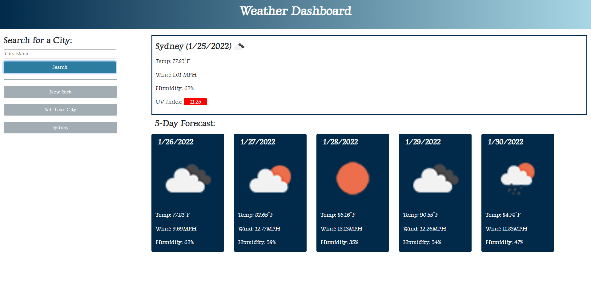

<h1>Weather Dashboard</h1>
    
This repo houses the codes used to build weather dashboard webpage, available at https://khklee.github.io/Weather-Dashboard/. 

<h3>Website Description</h3>
    
Wether Dashboard allows a user to search for a city and presents with current and future conditions for the city. Current weather conditions includes icon representation of weather coniditions, the temperature, the humidity, the wind speed, and the UV index. The UV index presents with a color that indicate whether the conditions are favorable, modertae, or severe as green, yellow, and red. Future weather conditions for the city searched displays the icon, the temperature, teh wind speed and the humidity. When a user clicks a city in the search history, it presents with current and future conditions for that city again.
    

<h3>Website Screenshot</h3>
    
